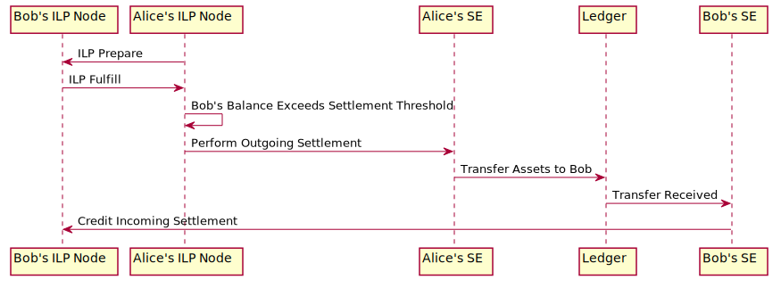

## ILP Single Ledger Payment

The ILP protocol makes a very clear distinction between clearing and settlement.
ILP Prepare/Fulfill messages operate at the clearing level and they adjust the balances of the peers without performing any settlement on the underlying ledger.
Once these unsettled balances reach a pre-established threshold, they need to be settled.
The connector, which keeps track of the peers balances, is responsible for triggering settlements in such cases.
More information on these concepts can be found at [ILP-RFC 0032: Peering, Clearing and Settling](https://github.com/interledger/rfcs/blob/master/0033-peering-clearing-settlement/0032-peering-clearing-settlement.md).

This example shows a simple ILP payment where both connectors are on the same underlying Iroha network.

First, all the necessary accounts are set up (more details on this can be found in the [`setup-accounts`](../setup-accounts/README.md) example).
Then, a payment from Alice to Bob is initiated.
Since the payment amount exceeds Alice's connector `settle_threshold`, a settlement on the underlying Iroha network will be triggered.
This is where the funds are actually transferred from one party to the other (from Alice to Bob).

The following diagram shows the sequence of actions that need to be taken for making a payment and then settle the balances on the underlying ledger.

